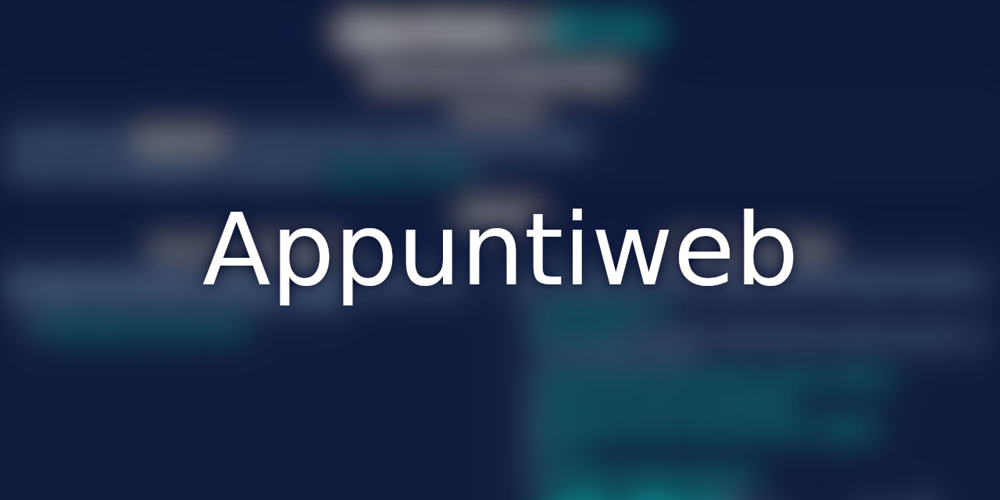

# 

A website containing the material I made to prepare for university exams!

## Contributing

All contributions are welcome!

Please help me making this an useful resource to all students everywhere, and correct mistakes if you find them! :D

## Developing

### Running a local copy

If you want to run a local copy of the website, ensure [the latest `nodejs`](https://nodejs.org/it/) and `npm` are installed on your machine then run:

```bash
git clone https://github.com/Steffo99/appuntiweb.git
cd appuntiweb
npm install --dev
npm run start
```

### Updating the website

To update the published website, just push the commit to the `main` branch.

[Render](https://render.com/) will do the rest.

Pull Requests are previewed through Render as well: when the deploy is complete, a bot will comment with the preview link.

## Structure

The website is a [Single Page App][1] created with [`create-react-app`][2] using [`bluelib-react`][3] for the styling.

[1]: https://en.wikipedia.org/wiki/Single-page_application
[2]: https://create-react-app.dev/
[3]: https://github.com/RYGhub/bluelib-react

### Temporary components

Some Components are temporarily implemented here pending introduction in [`bluelib`][4]: they are located in `/src/components/`.

[4]: https://github.com/RYGhub/bluelib

### Per-page components

Some Components specific to a certain page are implemented in the page's own directory: for example, `/routes/Gestinfo/components/`.

### Code style

Code style is all over the place, as [IntelliJ IDEA][5] decided to add newlines pretty much everywhere to enforce a 120-column hard wrap, breaking any sort of code style I was following. 

[5]: https://www.jetbrains.com/idea/